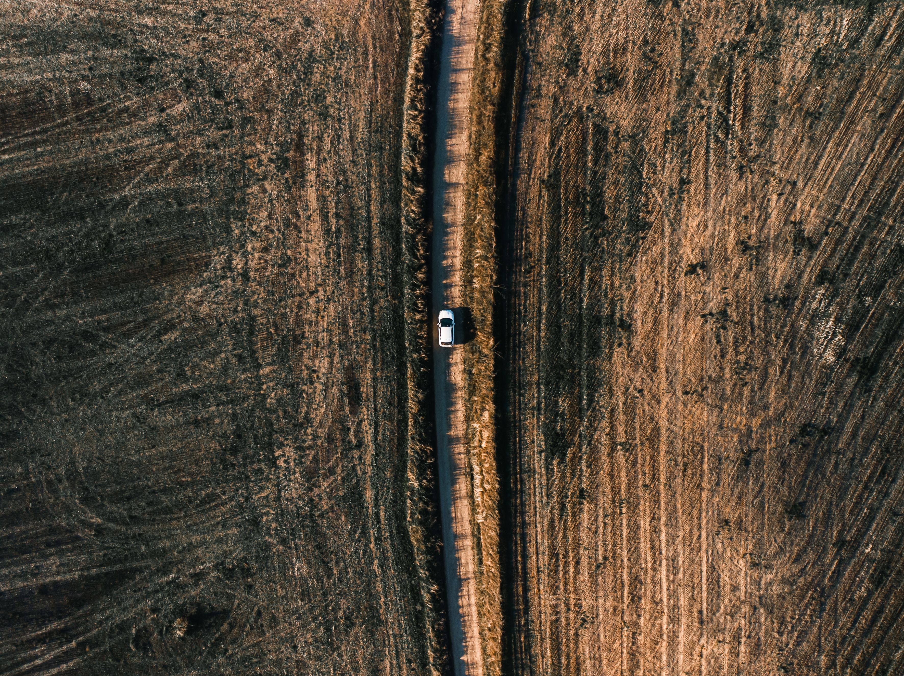
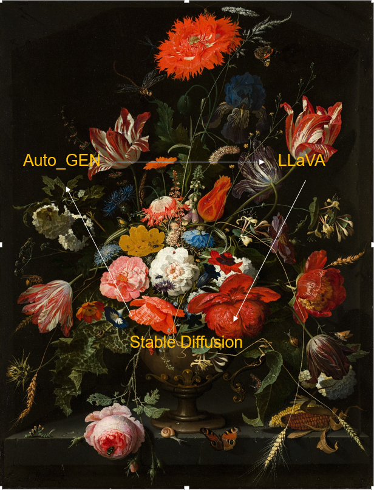

# 🧪 Mutli_Model_Vision_Agents
LLAVA/STABLE_DIFFUSIO/AUTO_GEN


*****
**🌍 AI Image generation**
1. Write prompt
2. text-to-image prompt engineer agent will write a prompt
3. stable diffusion will create an image
4. Image analyzer agent will compare with the origional prompt
5. Process repeat untill Image analyzer is happy with image

*****



## 🌐 How to run?
### STEPS:

Clone the repository

```bash
https://github.com/AleemAhmedKhan/Mutli_Model_Vision_Agents.git
```
### 💽  STEP 01- Create a conda environment after opening the repository
    
```bash
conda create -n agent python=3.8 -y
```

```bash
conda activate agent
```


###  🔍 STEP 02- install the requirements
```bash
pip install -r requirements.txt
```


```bash
# Finally run the following command
python app.py
```

Now,
```bash
open up you local host and port
```


## 📡 CICD-Deployment-with-Github-Actions

## 🛠 Deployment Steps:

1. Build the Docker image of the Source Code
2. Push the Docker image to Container Registry
3. Launch the Web App Server in Azure 
4. Pull the Docker image from the container registry to Web App server and run 
